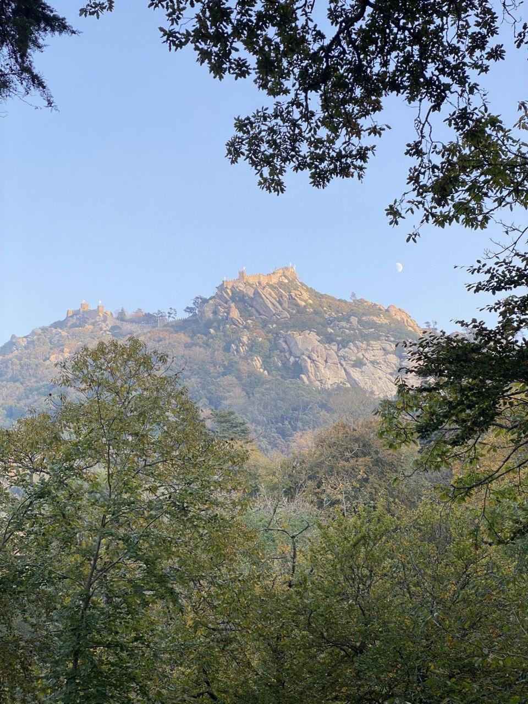
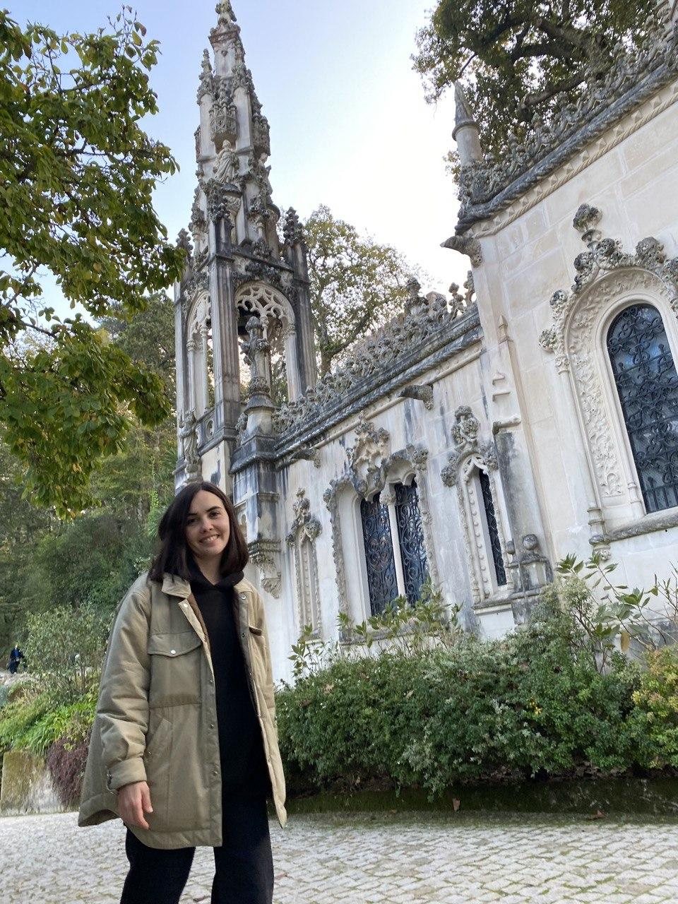
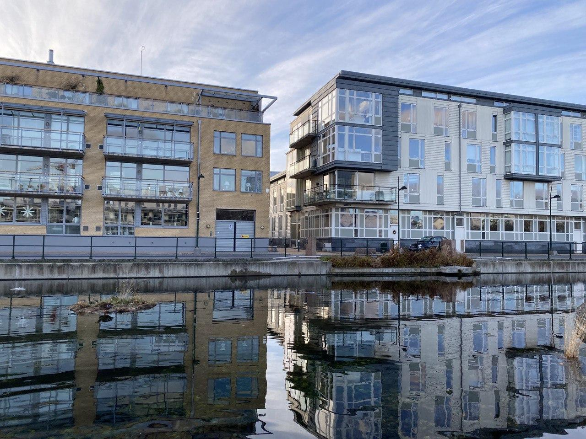
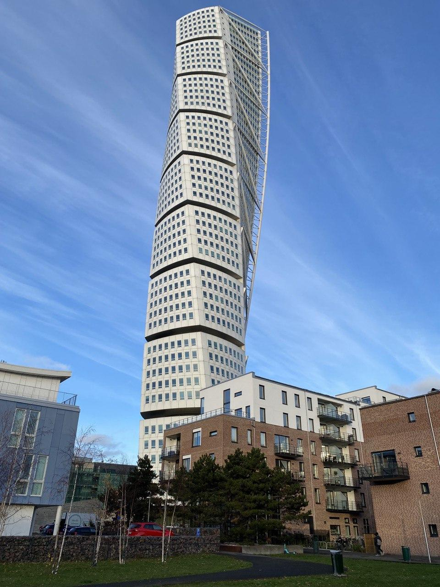

_Stockholm, Sweden_

November came to its end and it's time for a post.

## Events
Past month was both eventful and not, uneven in the same way as the entire year.
The first half of November was spent in Peniche, Portugal, surfing, chilling,
enjoying slow life. 

Then we returned to Stockholm. It was time to apply for my Permanent Residency in Sweden,
and the visa was rapidly expiring.

### Surfing
Learned a lot about surfing, again. Peniche is sort of a different set and setting
for me, had only beach-breaks, so it was a great learning playground to understand 
more about positioning yourself for a take-off and doing everything faster.

This time I had quite a few board-related adventures. To begin with, both my boards
had some accidents: the old one was severely crashed by a novice surfer just running 
his board into the tail of mine; the new was cut with a fin when some random dude
decided to take the wave I was riding for like 20 seconds already. Ridiculously,
that came as a total surprise to me – as far as I remember, I was passing a
closing section and was busy avoiding the water flying in my face, so I only
managed to see the guy when he was about to take off.

The latter episode was perhaps the first time I ever felt an urge to start a conflict
in the water. The etiquette is unambiguous about such cases - if you did a wrong thing
that led to a damage of another surfer's board, it's your business to fix it. 
I made that very clear to the person who damaged mine, but he just said that
he didn't have any money :shrug:. Honestly, I even got confused at that moment.
An instant urge to bring an equal amount of damage to the guy was suppressed by
understanding that even if I feel better after it (which I'm not proud about at all),
this won't fix the situation and I'm still left with a cut board that I need to fix.
Bummer. Of course, at the end everything is fixed and this whole debackle is just
another story.

Having no sticks to ride, however, presented an opportunity to try new things. I've
had a suspicion that my small wave board is suboptimal, so I tried a 5'8" Red Baron
twin fin from JS (which was great but definitely requires more practice) and
the same model that I had, Rad Ripper, but shorter - 5'10" instead of 6'2".
The shorter version worked _much_ better and now I think I'm pretty confident about
the sweet spot of volume that I need.

And at the end of the trip, I've sold the old board. It was a bit sad to part with it,
but this is an opportunity to get something a bit better next year. Looking forward.

### Vacation in Peniche
The vacation itself left a very positive set of memories. First of all, we spent
almost all of it with Adelya. Had nice dinners with friends. Went to Sintra together.
Celebrated my birthday. Even though the town itself isn't a really exciting place,
entertainment-wise, it still felt very nice and cozy.

#### Sintra
At the very end of the trip we went to Sintra, specifically to the town part of it.
I haven't been there yet; earlier this fall we went hiking there, but didn't get
to the most touristy parts (as planned).

Our place of choice was [Quinta da Regaleira](https://en.wikipedia.org/wiki/Quinta_da_Regaleira),
one of the palaces of Sintra. It is truly stunning! Beautiful architecture, neatly and
gently cohabiting with the rich nature surrounding it. I didn't read up on its story
beforehand, so was incredibly surprised to learn that it was built at the beginning
of XX century – if you asked me before, I'd bet it is at least a century older (I'm not 
really versed in architecture to precisely attribute the style).

## Sweden
Time in Stockholm wasn't very eventful, as planned. We wanted to visit Malmö, which
we did, and Copenhagen, which Adele did manage, but I put on a goof hat and totally 
forgot about my visa expiration. So I had to stay.

Malmö was amazing, though. Despite that I heard a lot about it, I didn't build up any
expectations, so came in with without any predisposition. And it delivered, immediately
occupying the solid second place in my personal top of places I've seen in Sweden.

The city is relatively small, but felt vibrant; made an impression of having
generally newer housing fond while maintaining the good ol' vibe. We only had
about 5 hours to spend there, so headed thru the city center to the Turning Torso
neighbourhood - the one with the highest building in Sweden and also the one 
famous for its modern residential architecture and urban design. So far it is my
favourite, I think. Stockholm has such new heighbourhoods, but they felt less cozy to me.

 

## Entertainment
We had long-time plans to re-watch The Matrix trilogy, which I was postponing again and
again to be able to watch it on a proper screen instead of a laptop. Finally we did it,
following by 2 videos from `ЧБУ`, explaining his theories about some plot nuances.

______

Another entertainment highlight was the new Apple Watch series 7, which Adelya
bought me as a birthday gift. I used to have the very first Apple Watch model, which
I didn't quite use much, struggling to find a reason. For series 7, however, the reason was 
strickingly clear once I watched the Apple's presentation - they worked for surfing!

And indeed, the watch has a set of apps designed to track your surf performance:
number of waves caught, total length of a ride, some per-wave decomposition etc.
Not something absolutely necessary, of course, but still interesting and useful.
Besides that, having a watch on a line-up is often underestimated until the time you
actually happen to be on one. 

Besides being a very good surfing device, series 7 is just... nice. As a device.
I think the fact that I didn't have anything in-between the first and seventh 
contributed to the satisfaction score, but it would be weird to not acknowledge the 
improvements of usability: at least the always-on screen!

______

Last month I bought Nintendo Switch and in November decided to listen to my friend Artem's
recommendation and bought Zelda BOTW. As promised, I was out of words at times,
so much it has stricken me with elegance of game design and overall _feeling_ of the game.

I haven't yet finished it, as my playing time dropped once we got back home. But I'm 
looking forward to long winter holiday evenings.

## Work and Projects
Sadly, the projects plans got severely delayed. Even though I realized that I might have
hard times making a decent progress, I ended up not having a good amount of spare time
to invest in any side activity. Work and Life took all of it, which I don't regret at all.

A takeaway here is that I should embrace the uneven pattern of life I have this year
and will likely have for some time and design the ways of working accordingly.

On the work side, however, most of things went as expected. I've started gradually
transitioning into a role that's in-between teams, driving the work to build a holistic
ML Platform and design the developer experience of a _platform product_ instead of 
a bunch of separate tools. 

Interestingly, this work phase consists mostly of designing the architecture approaches
and writing extensive design documents for the coming quarters. If somebody told me
3.5 half years ago that I would end up doing that, I think I might have been rather sad –
back in the days I had different view on what is worthwhile. Surely, I didn't think that 
writing such documents is a waste of time, but I didn't see myself doing that so often, 
focusing on implementation more. Luckily, there will be time for implementation as well, 
although I definitely won't be working on everything myself. Which is another thing
I learned to be comfortable with.

## Reading

I've finished reading `Вся Кремлевская Рать`, and `Thinking in Systems` by Donella Meadows.
I've wrote about the former in the previous post, so won't touch it again. 
`Thinking in Systems` did impress me, despite an initial impression of being too basic.
It is the second book I read this year (the first one was `Good Economics for Hard Times`) 
that _actually_ changed my mind and stance on certain topics I though I have very solid beliefs about.
This time it's the _growth_. I understood some environmentalist arguments much better
(even though they are _rarely_ structured from the systems perspective, IMO making the job
they are trying to do much harder). I have some ideas about structuring my thoughts about those
books in a separate essay, which I might tackle in December.

After finishing those, I've picked up `SICP` and `The Laws of Human Nature`.

## Plans for December

Despite the EOY pre-holiday vibe, December calls for a focused sprint at work,
as I have to do a big step outside of my comfort zone and work on a POCs for 
another couple of ideas for the next year. So I suspect this might take up a significant
portion of my brain resource.

I also plan to take my November iOS app plans and finally deal with them in December.

Besides that, holidays are coming, so I'm anticipating quite a few pleasant chores:
decorating the apartment, preparing for the Christmas season. 

I also hope that my Residence Permit card will be ready and I can visit friends.

