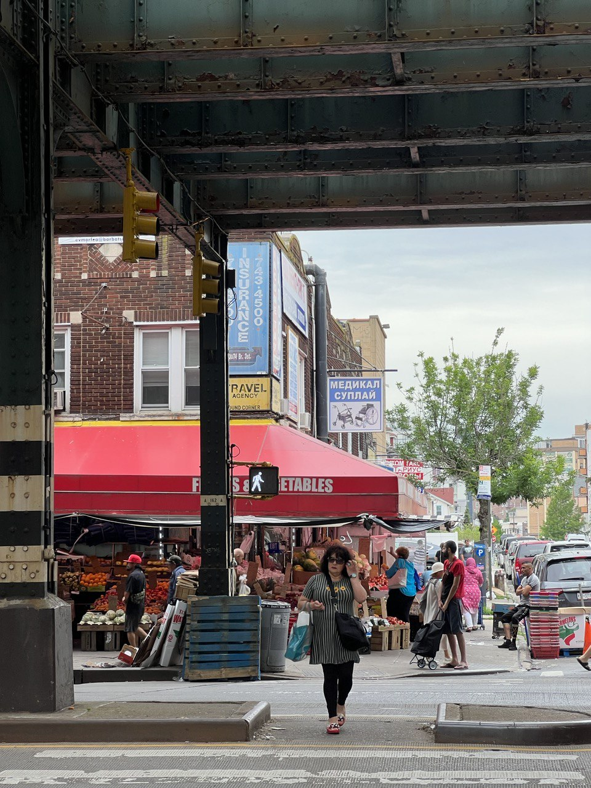

_July 6th, 2022, Stockholm_

June went by in a split second. The fastest month this year, by far.

It began in Rome, where we went together with Adelya for her US embassy appointment. In order to get a US visa nowadays, russians have to go great lengths - there are only a handful of places where an embassy accepts non-residents, and Italy is one of such places.  
While it was my first time in Rome, we were working and didn't have that much time to play tourists. Went around town a couple of nights, saw the great ancient sites, walked among toursist crowds and tried to eat a lot of gelato.
I think I liked being there, but mostly not because of the city itself but because of the overall vibe of the trip. 

Couple of random things from Rome:
1. Italians seem to avoid having a proper breakfast - absolute majority (for us it actually was all but one) of places don't have anything that you'd expect for breakfast - usually it's just pastry and coffee. Definitely not my jam - I'm absolutely convinced in the paramount importance of a good breakfast food, so had to get creative and drive scooters to what seemed like the only place with food which was 20 mins from our airbnb.
2. We stayed in 2 different airbnbs during that time and in both hosts spent about 15 minutes walking us through printed maps and printed slides with information on how to get around. In 2022 that seems... cute but a bit dated - who can get to Rome but won't be able to use basic apps to get around? On the other hand, every now and then we all meet a person holding a working phone asking for directions. Not judging.

All in all, my resume of Italy is that it is probably super nice to drive around, but I'd really love to eat something else - contrary to common opinion I don't find italian food that great. Not a fan of eating bajillion bread-based things. For Adelya it was even worse, taken that she doesn't eat gluten or dairy.

After a few days I flew to New York to work with my team. Stayed in Brooklyn this time, in Bed-Stuy, in what I later learned is a brownstone.
Not a fancy one, but just fine. Besides being a brownstone, the other new experience it delivered was an incredible acoustic - I could here literally all the steps that neighbors above me did - _all of them, even the lightest_. I nearly freaked out in the beginning, as the sounds were so present it felt like somebody is walking in my apartment and not in the one above. Besides that it was fine though. The place did what it should have - provided a bed, a table and could host my brother, who came from Boston for almost the entire duration of the trip.  

Spending so much time with Sergey was definitely the biggest highlight and joy of the month. We were living together, going to the office together (gladly, people were super chill about that), spending evenings together - everything I could dream about. Not being able to see my brother for 3 years was a pain and I'm glad the time of super strict travel policies is seemingly over.

New York things-wise I think we didn't do that much. Been to a few nice places, ate a lot of great ramen (can recommend [Chuko](http://chukobk.com/)), devoured quite a few of those great burgers from [Blue Collar](https://bluecollar-burger.com/) and finally made it to the Brighton Beach. Which if I'm being honest was sort of underwhelming. I definitely did expect more from the place... Not sure I can accurately put in words what exactly my expectations were, but I guess they involved a lot of cringy visual aesthetic from the mid 90s and 00s - signs, ads and so on. 
Of course, there were some, like this amazing offspring of english language meeting russian:

After pandemic and Work From Anywhere policies working from New York doesn't feel the same anymore.
More spotifiers than I thought took the work from home option and as a result the office felt quite deserted and empty. I didn't really dislike it (however there are some obvious downsides to that such as much, much worse food offering in the office itself), but I think the vibe is largely gone now.

At some point Sergey took a 4-5 days trip back to Boston (trying to fix his drivers license, which, spoiler alert, didn't happen) and I binge-watched the Apple TV's [Severance](https://www.imdb.com/title/tt11280740/). The show is truly amazing and worth all the praises it receives. 

____________

After working for 3 weeks, few after work beers and generally lots of good times in NYC we wrapped things up and proceeded with our week-long vacation in Boston. 
The initial plan was quite elaborate - we thought we'd take a short road trip to Bar Harbor, Maine, which is famous for its incredible nature and great beers. After that we'd spend the rest of the time in Boston area, further exploring the city with Sergey and Adele, who planned to arrive on 29th.
Unluckily for us, Sergey's driving licence renewal didn't get through (slow american bureaucracy didn't help), so we decided to stick to Boston for the entire time instead. It was still very, very good though - lots of sleep, good food, good drinks, leisured rhythm of the city and extremely hot weather was quite enough for us.

When Adelya arrived we went to what turned out to be one of the most interesting museums I've been to - [the Isabella Stewart Gardner Museum](https://www.gardnermuseum.org/) (read with boston accent if you can). Nothing fancy from outside, the museum shines as soon as you get inside. Built after a Venetian palace, it has an incredibly picturesque inner yard with a beautiful exotic garden and it is surrounded by galleries all the way to the top.

I won't go into lengthy description of the museums collection, will just mention that it's definitely worth visiting. 
It strikes you with consistency of vision, the sheer scale of it and its beauty. It's also been in scopes of art thieves and the museum itself is home to the largest art heist to date. Pretty random, right? Did not expect it to happen in Boston of all places. There is a good documentary about it, called ["This is a Robbery"](https://en.wikipedia.org/wiki/This_Is_a_Robbery), which I'm currently watching.

______

Got to meet a few more folks, mostly Sergey's friends from volleyball. They had us over for a bbq party, which was very chill, light and fun. Also met up with another Sergey's friend who I knew for quite a few years now. He currently works on his PhD in physics in Harward, and I got a chance to ask a few questions about the institution and the PhD life there.

______

As I already wrote, spending time with my brother was everything I could wish for and once again it got me thinking about life a lot. I think we need to live in one country, whatever that is - US or somewhere in Europe. This is a difficult project to pull off, all things considered. But definitely possible; and both of us are on our way to naturalization in our corresponding countries.

Watching my brother's hobby and interests got me inspired, and I've decided to try to give up video games (at least for a while; will see how it goes over time) and start biking again. This time we are thinking about fixies. I haven't yet tried riding it, but something tells me that I won't hate it.
Just got to get one :) I only have a road bike now and scoping out a few options now: either buy a fixie and upgrade my road bike over time (it can be tuned more to my build and tastes) or to turn my road bike into a fixie and buy a new roadie when need arises. Flo suggests the latter, but I'm still torn.

I've left my Nintendo Switch in US with Sergey, so he can have some fun playing Zelda and hopefully other amazing games. 

_______

Got back to Stockholm on Monday, 4th. In hindsight - should have stayed for 1 more day to catch the Independence Day and celebrate it together. Shame that I didn't think about it before :(

_______

I don't have many content recommendations this month, but I've started to use a new app for reading articles that might permanently replace Pocket for me - [Alfread](https://alfreadapp.com/). Sadly, after being bought by Mozilla, Pocket seemed to have frozen in time and didn't get as much love as it deserved. As a result, Alfread got a chance to win the market. What I like about it is the extremely simple but fun gamification and goal setting. 
