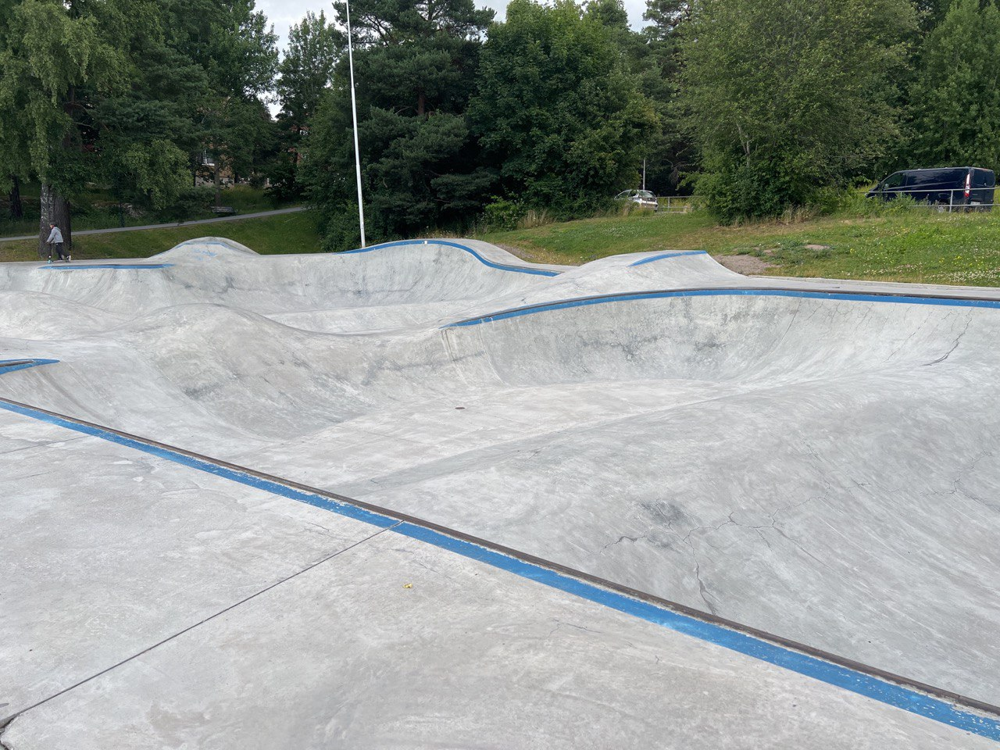
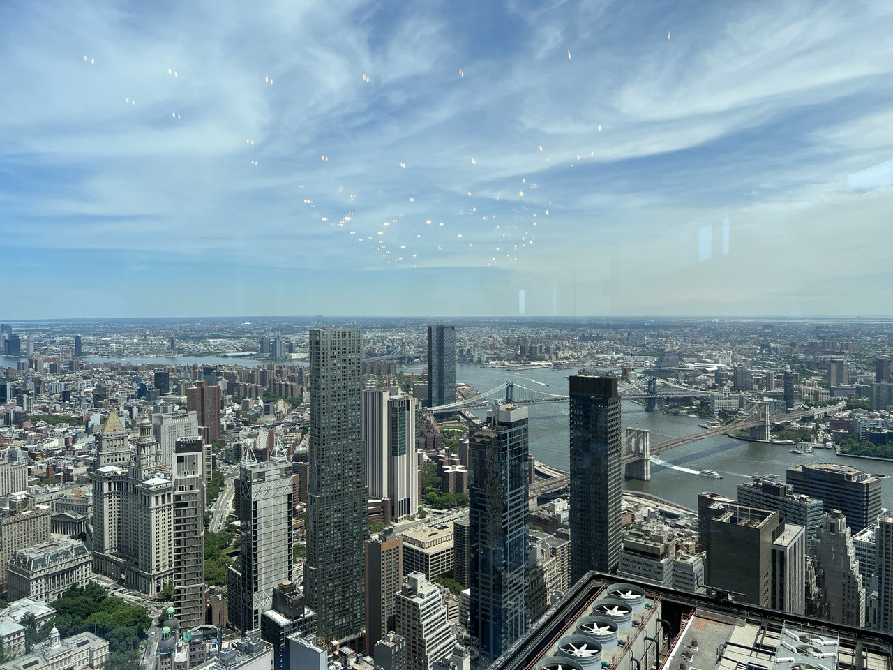

_August 9th, 2022. Stockholm, Sweden_

Another month, another delayed lookback post. I've started writing it in Newark, NJ, on Saturday, but words weren't really coming to me back then. 

The main update of this edition is something I'm ready to talk about sort of "publicly" - time has come for me to leave Spotify. It was an _incredible_ ride, and I will write a full separate post about it once I return my badge, but for now I just want to say that I was so lucky to work with some of the most amazing people and most incredible engineers I've ever met.
This decision wasn't easy to commit to - as I was replying to recruiters for years "it's really difficult to pull me from Spotify, as I'm working in the team I'd love to work with the most". But I'm full of hopes that my new journey will be on the similar level. I plan to start in October (Sweden has ridiculously long notice periods), so I'll write more about it in October edition. Not yet.

Shortly after I've announced my resignation, my manager did the same (which was funny, but our cases are totally unrelated), and we've decided that it'd be great to get back with the team once again before our departure from the company. One rarely has a luxury to say this, but it was as easy to do as to say :) And after spending about 3 weeks in Stockholm in July I flew back to NYC for another 2 weeks stay. And man, was it eventful.

First of all, Sergey was again able to come over and I got another precious 2 weeks of spending time together. I wrote it before, but want to just capture this again - spending time with my brother is such a highlight and a pleasure, that this summer automatically becomes one of the best times in recent years.

We stayed in an AirBnb in Bed-Stuy again, although I have tried to not do this. We definitely got a better place this time though, facing Fulton street - at least it didn't have the acoustic problem like the time before.

The adjusted location unlocked an easier access to my friends and colleagues who live in better parts of Brooklyn. We had an amazing time doing a BBQ at a friend's place and a few parties during the last week.  
Hanging out with people I deeply respected for a long time (there were also some folks I knew about, respected their craft, but haven't really got a chance to meet properly before) is yet another highlight of the trip. Also I got to introduce Sergey to that party, who fitted very well.

With all the business and pleasure came some truly American experience. Unfortunately, not the nice kind. We were on our way home from work, some time around 7pm, rounding a corner on Fulton (which is a pretty big street with constant traffic, both pedestrian and cars) when heard what I was hoping for some incredibly long few seconds wasn't a gunshot. 
It was. We saw a guy strolling down the other side of the street away from us, general public around us disoriented and lost, and lots of eyes looking at the direction from where the guy was jugging from. A car was parked right in the line of sight, so we couldn't see anything initially. 
I think after we instinctively waited for a few seconds to "make sure" no more shots are fired, we carefully made a few steps forward and then Sergey made the best decision at the time - he called 911 and reported shots fired.

Maybe a minute later cops and ambulance arrived. Striken, we returned home, and the next day read [this](https://www.nbcnewyork.com/news/local/mcdonalds-employee-shot-in-bed-stuy-after-argument-with-customer-led-to-gunshots/3804549/) - a mcdonalds worker was shot as a result of an escalated argument over, allegedly, _cold fries_. A lot can be written about it, but I will quitly leave it here. Apparently, the shooter came forward to the police and also confessed to murdering another person 2 years ago.

Closing and maybe surprised thought to follow the section above: spending half of this summer with my brother in NYC and Boston made me really think `do I really follow my own priorities long-term?`. Should I really give up on the idea to move to the US? Short-term obviously I need my passport, but long-term... I will need to reflect on this more.

__________

On this note I'll get back to the time before the trip, for it was great as well. As I wrote in the past lookback post, meeting Artem in May and spending time with Sergey motivated me a lot, so after arriving home in the early July I felt very determined to push a few things hard. Actually, for the very first time after landing a job in Spotify and moving to Stockholm I felt the presence of "my old self" - the person that was going at hard at a few areas: learning, sports.  

I started studying the long-awaited [Into to Biology course (MIT 7.00x)](https://web.mit.edu/mitxbio/courses.html) that Artem has recommended. I'm only at the beginning now (didn't really study as much in NY), but _very_ excited about the material. To begin with, the first units already advanced my understanding of biology and chemistry beyond what I knew from high school. And it's _exceptionally_ interesting! Last, but not the least, professor Eric Lander is undoubtfully one of (if not _the_) best lecturers I've had an honor to watch, even online (a close runner up is CMU professor Andy Pavlo, but I'm sure he'll appear in future lookbacks).

I've also started and finished a course I _really_ didn't want to do: [Stanford's ML System Design (cs329s)](https://stanford-cs329s.github.io/syllabus.html). The reason I was reluctant is a little weird - I am generally _very_ sceptical of the entire ML Ops hype machine and believe that treating ML infrastructure problems and software that includes ML as _any_ other software problem is beneficial long term - after all it's all just Computer Science. (Although, fair to admit, I myself do benefit from the hype). Despite all the scepticism, I took the course and can say that it is definitely better than I expected. Will put it this way: a professional seasoned in industrial ML applications will hardly find anything new there, but I do think that the course (and the book behind it) provide a good overview of the diverse set of problems existing in the field. I've found myself recommending taking this course to a junior engineer that joined my team recently; and I think I will continue doing that. In fact, I took the course mostly because I know that my future teammates took it, so I wanted to be certain about guaranteeing some common ground from the get go. At the end, time well spent!

On the other notes, I've finished reading [The Deficit Myth](https://www.amazon.com/Deficit-Myth-Monetary-Peoples-Economy/dp/1541736184). Originally, I got motivated to read it by following Alex Petrov's twitter (IIRC he is an Apache Cassandra comitter, one of the biggest Database experts I know about), where he posted a single screenshot of a book page. I don't want to search for it, but it definitely got me hooked. The book, however, made an interesting impression. Throughout the entire reading journey I was almost suspicious, often squinting my eyes at lots of presented arguments, albeit this behavior and attitude feels expected by the author. At the end I think I'm way closer to believing the arguments outlined in the book, but this topic needs further inquiries from my side - right now I simply don't feel competent enough to challenge the main point - that a state with a souvereign currency a) can't go broke and always has money (that's a simple one though and I don't really doubt it) and b) that printing money to cover all the necessary costs for running the "people economy" won't just drive the inflation (that's a tough one). I can recommend reading the book though, it can broaden one's horizons.

Besides going full on studying, I'm glad to say I managed to train a lot. Two things here: gym and surfskate. And both in a way I didn't anticipate before.

For gym I've decided to extend the approach taken before for a short period of time: instead of going to a dedicated gym in my neighborhood, I started to go to my _basement_ gym (which is, quite literally, a tiny room in the basement of my building). The gym has only a bar, a 10kg barbell with smth about 120+- kg weight, some dumbells and a bench. For a year I was very sceptical of potential of such setup, but with some dedication and creativity it truly bloomed! I've decided to change the training approach to be more focused on intensity and frequency of workouts, instead of having more traditional heavy training sessions. So far I'm very happy about this routine change and excited to continue.

On the surfskate front there was a discovery as well: I've accidentally found an incredible bowl setup about 15mins by bike from my place. Offering a decent range of steepness and transition shapes, this place is a very good training ground! I've been going there about 3-4 times a week and have seen a great progress in building muscle memory for the main maneuvres. I do have a very long way to go there, but super excited about getting back at it now!

Worth mentioning the biking part as well. I haven't really utilized my bicycle last year, but taking it from the storage room really allowed me to leverage the skatepark - without it getting there is a much more involved process and it'd be certainly harder finding motivation to do that with that cadence.

_________________

A week after my arrival Adelya came from her brief trip to LA. We had a great time here as well, including a new SPA pool right in the center of the city (at Downtown Camper hotel), which I didn't even know existed, and the first dip in a lake this year, followed by not first but great BBQ with Flo.

The SPA center is definitely a find, as the only one I knew about, Yasuragi, is great, but has a major downside of being a full-day experience. Despite being very satisfied with it, I always was wandering a little what if it was something more condenced in time, so one can do something else on a SPA day as well. The newly found one definitely lacks the views and the atmosphere, but is very good still and allows for a before-lunch-middle-of-the-week experience, which feels closer to being "my type". Of course I wouldn't find it without Adelya, so definitely kudos to her!

_________

Links:
* I've found myself citing this article multiple times this month: [Difficult Problems `vs` Hard Work](https://benjamincongdon.me/blog/2022/06/22/Mental-Model-Difficult-Problems-vs.-Hard-Work/)
* [In defence of simple architectures](https://danluu.com/simple-architectures/) - not eye opening, but a good reminder that most of problems _don't_ require over engineering. Simplicily shouldn't be overlooked
* [Why I built a dictionary app](https://www.wordnote.app/blog/why-i-built-dictionary-app) contains a link to the best dictionary app I've had so far

__________

To close this post, a photo. This view is breathtaking any day of the week and absolutely doesn't get old. I will miss working shoulder to shoulder (albeit remote) with my dear friends and colleagues, but this is the solid second place.

