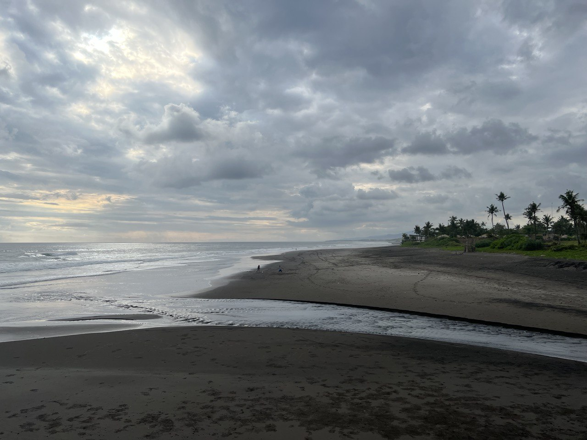

_Stockholm, Sweden, October 11th, 2022_

It's been a while since the last lookback, but, again, probably later is better
then never. This is going to be the joint lookback post for both August and September,
which might even be fair, as they felt really like one month.

## August 2022
After returning from the second NYC trip at the beginning of the month, the rest
of August was primarily making sure my work is in order and there are as little
loose threads as possible. However, I definitely can't say that I've lost interest
at that point. Luck turned its face to me again and let me work alongside the people
I wanted to work with on "my last project", so the times were good.

However, it wouldn't be true to say that my heart was fully at it. August came around
very nice, Adelya came to Stockholm, the weather was good and, as a cherry on
top of it, I was full of anticipation of my upcoming Indonesia trip.

Having a surf trip coming up got me really excited, way beyond what I was imagining
at winter, riding snowboards. But after all, I guess, surfing was the first and occupied
the bigger part of my boardriding passion. I've tried to keep up with my relatively
diverse training schedule, doing both gym and surfskate as much as I could. The
progress in the latter felt significant at the time. At some point in August
I've realized that the skatebowl I was going to at the time felt a little restrictive
(crowds, lack of space and variety of transitions), and I've decided to try
the biggest (and probably the best) park in my area - the Highvalley Skateworld.
It definitely didn't disappoint! Having a huuuge facility, that would have enough
space even if it had 30 people at the same time did help in terms of maxing out the
efficiency of time spent. On top of it, it has a gigantic inclined ditch, that 
looks almost as if it was specifically designed for surf skating. Great find!

Feeling that my time with Spotify is about to end, I've tried coming to the office
more often. After a long covid-19 pause the company started doing the Stockholm-based
Intro Days sessions again, and a bunch of my colleagues that have joined the org
during the pandemic got a chance to come visit. Lucky time for them, as they
got to see the summer at its best. I took one day off and showed folks around,
took a nice swim at a lake down by Långholmen and generally had a great time.

Towards the end of the month we finally visited the local amusement park, Gröna Lund,
with Adelya. The local park isn't famous for its wild rollercoasters, being 
taylored mostly towards younger kids and family-friendly activities, but it was really
fun! I definitely enjoyed the time spent although I'm not a huge fan of rollercoasters 
in general - having seen my love happy and excited is a bigger happiness booster
than adrenaline-infused entertainment.

As the days flew towards the end of the month, I've sorted out my Bali plans,
ordered a board to pick up there, and was wrapping up the final few days at the 
company. The last day... - well, practically the last working day, as I've had a 
long vacation coming up before finally resigning - felt heartbreaking. As I wrote
in the previous post, I plan to write a separate text about my time at Spotify,
but for now I'll just say that I couldn't manage to not drop a tear coming home.
Despite having a bumpy ride at times (almost all of it at the beginning), my
almost 5 years with this music beast were definitely very good. The people I've met,
the projects we've done, the times we had together - it felt and feels very special.
This time grew me immensely and I was full to my ears with gratitude. Still am.

At the end of the month I flew to Bali. The trip took longer than the last, and
in hindsight, being slightly cheap (well, as much as one can be cheap paying
these insane flight prices nowadays) was my first mistake. I took Thai airways
instead of Quatar, did it without looking twice at their policies and got 
a special 150$ fee for the board bag. In all my trips before never heard of it.
Fitting into the regular special luggage parameters usually makes surftrips an
easy affair when one only has to buy as many check-in luggage spots as surfboard
bags as well; but Thai apparently has this anal policy of additional charges.

After spending a day in transit, finally landed on the island, just a day before 
one of the best swells hit Indo. Can't really describe how excited I was!
But the second mistake came around swiftly, I did paddled out in a weird place I
didn't know that well (mistake!), hit the board and to top it off, hit a freaking
sea urchin. Like kicked it, almost, being thrown by a rogue wave in the direction of 
a dry reef. Deploying safety measures in the form of extended leg didn't work as
expected and I ended up pulling 1cm of an urchin out of my foot and having another 
2 spikes very deep close to the ball of the big toe. 

Local hospitals were weird experience. Another rollercoaster I didn't like to ride,
this time - emotional. The first doctor I've seen immediately suggested doing small surgeries
to pull the spikes out, which really scared me at the time. However, they didn't feel
quite sure about actually performing it, so I had to go to another ER. Who, in order,
decided to not do it. Surprisingly to me, after hearing that I might need one, I've
really done my best to convince them to cut the wounds up and pull the spikes, but
had no luck, the urchin was there to stay.

______________________

## September 2022
The swell was decreasing, the urchin hurt, but luckily, it was in my left foot,
so after a few days spent on fixing the board and getting rid of the swelling,
I was back into water. Man, I've missed surfing! Time after time I experience it,
I know that I need more of this in my life. To be able to not surf just on vacations,
but to do it weekly, if not daily.

I've stayed at a guesthouse quite far from any beach, but despite the description,
the place had some advantages. The biggest one was being close to my old friend,
Sasha, who taught me how to surf 6 years ago, during my first trip. Meeting him 
again after so many years felt incredibly good! Unfortunately, we haven't had
as much time as I'd wish, as he had to entertain his girlfriends parents who also
came to the island in September, but some time is better than none.

At the beginning of the trip I've tried to maintain some sort of learning schedule
and discipline, but quickly ran out of strenghts to go on. Not having the right 
setup and proper amount of desk space, feeling tired from surfing twice a day
made it really difficult to focus on studying. So the rest of the trip was 
incredibly unproductive, to say the least.

After waiting longer that I was hoping for, I finally got my second board from the
shop. Selling my first own board last year in Portugal, I lacked the daily driver
type of a stick and had spent a lot of time researching the options. Ended up picking
Pyzalien 2 model from Pyzel and boy, it did not disappoint at all!

The board is shorter, 6'0", has effectively the same ~32 litres volume, but is so
much more foregiving and easy to catch smaller, less energy waves! The flatter entry
rocker and the wide point located more in the front works a charm. As an experiment,
I've fit it with 2 traction pads, back and front, and liked that setup as well.
Having the front foot locked in wasn't so much a game changer for my surfing,
but it does feel nice and easy to just know to be placing it in a right spot on the board
and not having any disturbances due to it. The downside, however, is the increased
rub, and it's generally better to have a wetsuit on. Portugal type of a stick.

Few days flew by really fast and I was all of a sudden hit by some sort of 
a weird gut infection, that knocked me out competely for more than a week. Couldn't 
eat for a few days, had fever ones and the only thing I could focus on was to not
lose too much water from my systems. Ended up losing the entire muscle mass I've made
working out during the summer. Lost most of the strengths and paddle power. Lost
good mood completely.

To this day I'm not sure what caused the infection, but my best guess is that
after one rainy night the water was so dirty that something must have gotten inside,
like a rogue _E.coli_ or alike. However, mom tells me that it could have been covid
(doubt it, but didn't take the test at the time).

The worst part of this wasn't the sickness itself, but that it rendered my
planned trip to a nearby island, Sumbawa, invalid. We were planning a week long
surf coaching trip with my friend (me being the student, of course), but I couldn't 
make it. 

Surprisingly, between the urchin and the stomach virus, I didn't get into some 
depressed state and generally took it as a setback, nothing more. Have to thank
11 years doing swimming professionally, I guess. Shit happens, but with enough
persistence it is just a setback and there will be better days. And we keep moving 
forward.

Surfed last few days, packed the boards and flew home. The first mistake made a boomerang
and hit me again, this time, however, with twice the fee. Apparently, Thai Airways
are so damn greedy, they charge not even for the board bag, but per board. Another
300$ left my wallet.

Came back to Stockholm, officially resigned, re-lived the last day again (this time
it was easier, no tears). I had 10 days till the first day at my new job and
they looked promising: Igor was coming from London for a few days, Adelya was
coming from Moscow for 2 weeks. 

However, the August had its own plans. Just around time I've arrived to Sweden,
Russia announced mobilization and that wrecked the lives of few friends that were
staying in Russia completely. 

I was really happy about folks coming, though. I haven't seen Igor in almost a year
and having him over was a highligh. As always, we had hours of conversations,
walked around the city, met Flo for a while and had good time. 

The last week before starting new job felt nice. I didn't do much and wanted to 
salvage what I had left of my downtime before diving into new challenges.
We spent a lot of time together with Adelya, walked around, ate out, met some friends,
celebrated Flo's birthday and just chilled. I've also built a regular skateboard
for riding transitions, but did ride it only once due to bad weather and rains.

At the last days of September I gave up and bought Elden Ring again, this time
for PS4. Guess it is the game I'll have to finish, can't just let it go.

Closing the September part on a serendipity news. I bought in-ear headphones,
Beats Fit Pro, that support Apple's spatial audio. It blew my mind away! The feeling
of volume it creates, the feeling of being present when watching movies with it
is something I did not expect and actually almost tripped a few times, confusing the 
sounds from the video with something happening in my surrounding space. Can definitely
recommend!

In October I started a new job. But it'll be a story for the next lookback :)
